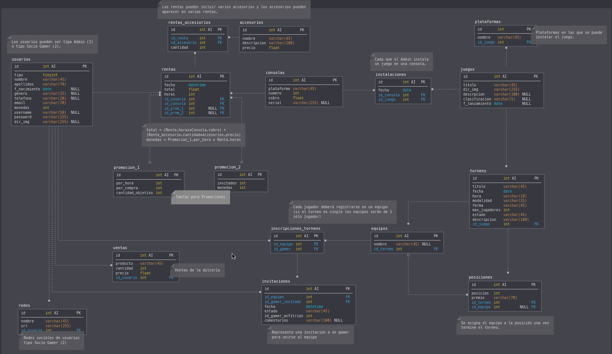

# Proyecto Programación Web en PHP - Jasso

## Database

## Cambios en la BD
Script de la base de datos en `db/` (MySQL).
- Se agreó la tabla `invitaciones`. 

Login:
- user: admin
- pass: admin

## TODO
- Admin
- Socio Gamer

## Dev
- `controllers/` codigo php para instrucciones sql.
- `include/` partes html para requerir desde las vistas; header, footer, modals.
- `db/` 
- `uploads/` directorio para guardar las img de los usuarios, juegos.
