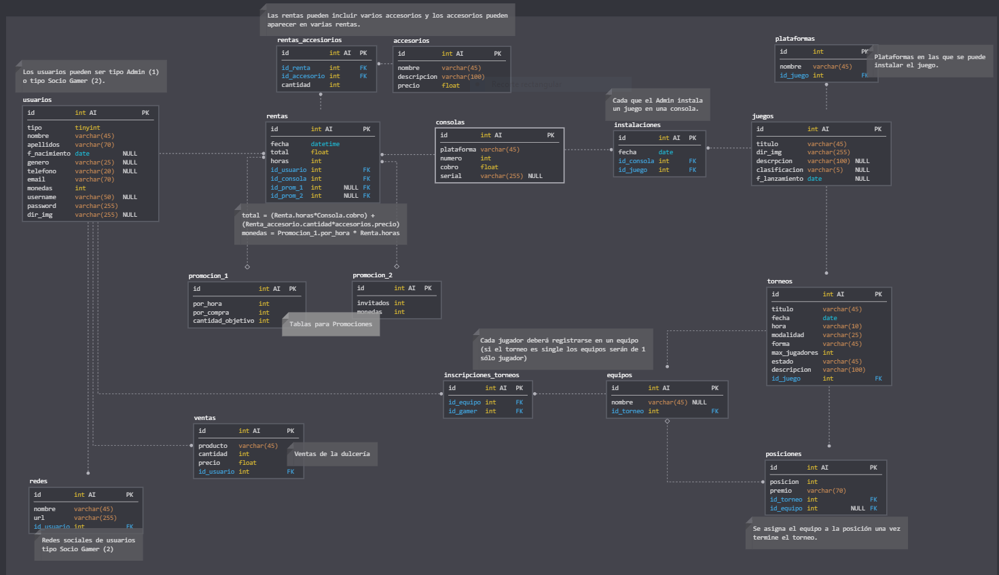

# Proyecto Programación Web en PHP - Jasso

## Database

**[Diagrama de Base de Datos](https://app.sqldbm.com/MySQL/Edit/p103584/)**
Script de la base de datos en `db/script.sql`. Contiene comentarios respecto a algunas tablas, atributos y relaciones.
** Base de datos sujeta a cambios

## TODO
- Admin
- Socio Gamer

## Estructura de proyecto
- Directorio `app/` contendrá TODO el proyecto y en el cuál estarémos trabajando.
    - `components/` Código php para comunicar vista y base de datos.
    - `config/config.php` constantes de ruta y nombre de la app.
    - `db/` Scripts, procedimientos y conexion a base de datos.
    - `models/` Código de inserción, actualización, eliminación o actualización de registros de la base de datos.
    - `views/` Todo el codigo html con las vistas; formularios, modales, header, sidebar, footer, etc.
        - `include/` partes html que seran incluidas en las vistas; header, footer, sidebar.
        - `modals/` en caso de utilizarlos, estarán en este directorio
        - `pages/` paginas/vistas del proyecto
    - `run.php` llama a la vista principal de la app
- Directorio `public/` contendrá código extra no protegido, css, js, imgs, fuentes, librerias de estilizado, icons, etc.
    - `index.php` Archivo primero en ejecutarse, llama a `app/run.php`       
- Directorio `theme/` contiene todo el tema/plantilla de la cual estarémos sacando componentes para las vistas; graficos, botones, inputs, tablas, formularios, etc.

## Acceso 
http://localhost/jasso_proy/public/index.php
**sustituir 'jasso_proy' por el nombre de tu carpeta de proyecto**

## Notas
- Cambiar el contenido de la constante `RUTA_URL` dentro de `app/config/config.php` en la parte `/jasso_proy` línea 11 por su carpeta de proyecto.